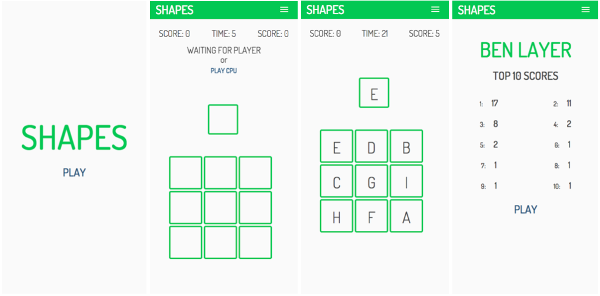
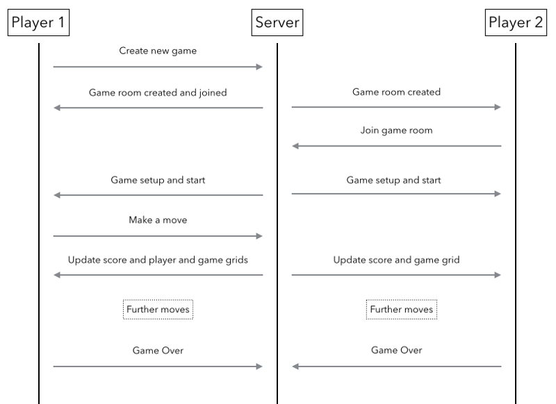

# WDI-project-4
## SHAPES

SHAPES is an online multiplayer game based on a well-known toy for children where a player must match blocks with a hole of the same size and shape.

The twist on the traditional toy that the game employs, and what makes the multiplayer mode exciting, is the dynamic nature of the grid. A correct move by a user causes the grid to change, thus testing not only the visual awareness of a user but also their reaction time. The end result is a fast paced, fun and often frantic gameplay during the 30 second time period.

You can play SHAPES online here: <http://freeshapes.herokuapp.com>

## Motivation

SHAPES was to be my final project at GA. Having greatly enjoyed tasks that involved an element of logic throughout the course I wanted to build something that re-introduced this back into my work. I also wanted to use the opporotunity to learn and experiment with a new technology, in this case  Socket.io. Socket.io was something I had only encountered briefly before and most examples of it's use seemed to be related to chat applications. I therefore thought it would be fun to create something a bit different and combine the logical problems I enjoy with the use of Socket.io to create a multiplayer game.

## Installation
If you wish to run SHAPES locally on your machine the you will need to:

1. Ensure you have Node.js installed

2. Clone the repsository: 
  * ``git clone git@github.com:benlayer291/wdi-project-4.git``

3. Install the dependences:
  * ``cd wdi-project-4``
  * ``npm install``

4. Start the server: 
  * ``node index.js``

5. Open your browser and visit <http://localhost:3000>

### How to play

1. To play you must be a registered user. You will need to register or sign-in by following the links on the homepage or by using the navbar.

2. Once logged in a you can access the active game screen. Here you can choose to either:
  * Join an exisiting game i.e. one created by another user who is waiting for a  fellow player. (If using locally, the other user will need to be running the game locally as well on their computer.)
  * Create a new game to play against another user or against the computer.

3. Upon a game having a two players, be they both human or human and computer, the game-grid and player-grid will be loaded and a 5 second countdown until the start of the game will begin.

4. When the game starts, you have 30 seconds to score as many points as possible and certainly more than the opposing player. To score points you must click on the square on the game-grid that matches what is shown in your player-grid. When a correct move is made, the positions on the game grid change.

5. Scores and the time remaining are shown at the top of the screen.

6. When the game time is up, whether you win or lose will be displayed.

7. Your top 10 scores can be seen on your profile page, accesible via the navigation bar.

8. You can logout via the link displayed in the navigation bar.

## Build
This app was built using:

- Node.js, Express, AngularJS and MongoDB (MEAN stack)

- Socket.io to add multiplayer capability.

- HTML5, CSS, jQuery and the animate.css library also used on the front end.

## How it works
Below is a simplified diagram of the some of the most important events in the use of Socket.io in the multiplayer game.

## Approach
After conceiving the initial idea a basic JavaScipt version of the game was created on a static site page. This was done so as to understand the logic behind the game. At this stage the logic of a computer player was also devised.

Wireframes were then drawn up to compliment thoughts about the user stories.

The challenge of setting up the game as a multiplayer game using Socket.io was then approached.

Following inital success of getting the game to work in it's most basic version, a backend was added so that users, games and scores could all be created, stored and accessed.

Initial styling was applied to the pages once the most basic version of the game was working with the backend.

Listing of available games and the option to play against a computer was added in at the end.

## Challenges

This was a challenging project but one that as a result proved to be immensely rewarding. Having initially built a simple one player JavaScript version of the game to work out the logic, the real test came when setting it up to work as a multiplayer game with Socket.io whilst also making use of a database to save a users details and scores. Socket.io was an unknown technology to me and so it was pleasing therefore, that when left to my own devices I was able to make efficient use of the documentation and the wonders of Google to produce a working app. 

## Developments

- A search capability to find the game you want to play, rather than choosing from a list as this is not very scalable.

- Different versions of this game. There could be an educational purpose to it, where for example a player has to match a lower case letter to an uppercase letter or a word in a foreign language to it's meaning in their native language.

- Linking the game play on your phone to a big screen, i.e. using your phone as a controller and the big screen as the game display.

- Improving the code.

Overall, having learnt a lot about how WebSockets work whilst using Socket.io, I look forward to experimenting further with the range and depth of possibilities they offer in the future.